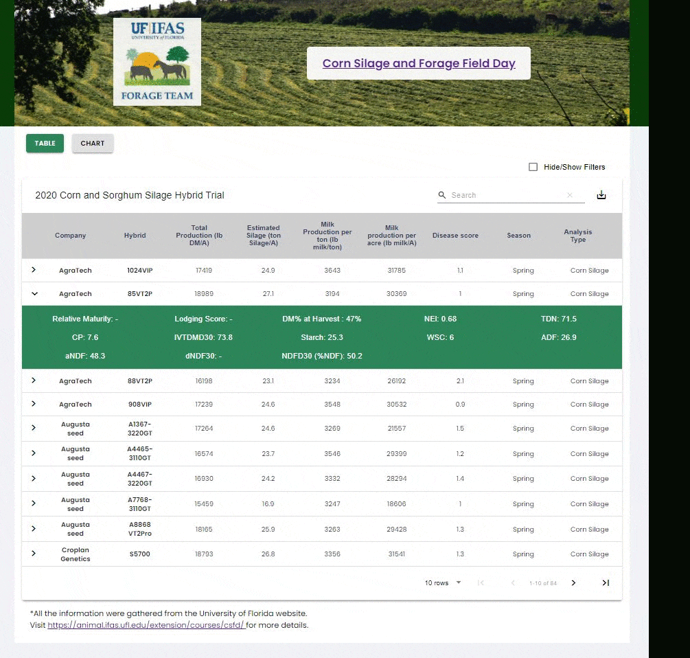

<p align="center">
  <a href="https://devfel.com/" rel="noopener">
 </a>
</p>

<h1 align="center">Hybrid Trial Table - Forage</h1>
<h2 align="center">Corn Silage and Forage Field Day - University of Florida - Animal Sciences</h2>
<h3 align="center"> 🔗 Try it live at: https://devfel.github.io/forage-hybrid-table/ </h3>

<div align="center">

[]()
[](/LICENSE)

</div>

---

<p align="center"> 
Table and Chart presentation of data gathered from the University of Florida Field Day. <br/><br/>
This is a <b>responsive</b> project using HTML, CSS and TypeScript and React.</p>

  <p align="center">
    </a>
  </p>

---

## 📝 Table of Contents

- [Test Here](#live)
- [Application Features](#features)
- [Getting Started](#getting_started)
- [Dependencies](#dependencies)
- [Built Using](#built_using)
- [Acknowledgements](#acknowledgements)
- [Licenses](#licenses)
- [Authors](#authors)

---

## 🕹 Test Here <a name = "live"></a>

https://devfel.github.io/forage-hybrid-table/

---

## 🧐 Application Features <a name = "features"></a>

- **_Switch between table and chart:_** Buttons to switch from the table view to the chart view.
- **_Data in JSON file:_** Data gathered from excel file and converted into a JSON file.
- **_Search, Filter and Adition Information:_** In the table it is possible to filter data using the fielter fields or search for specific information in the search bar. It is also possible to show additional on a specific hybrid by clicking in the show details button.

With this application the user is able to:<br/>

1. navigate between two pages. <br/>
1. list all the hybrid data in a table format <br/>
1. check the scatter plot chart with all the hybrids <br/>

---

## 🏁 Getting Started <a name = "getting_started"></a>

You can clone the repository through Command Prompt or Terminal just by typing:

```sh
git clone https://github.com/devfel/forage-hybrid-table.git
```

or download the zip from the green **"Code"** button.

Install dependencies packages with yarn

```sh
yarn
```

to run localy it is possible to using the yarn start command:

```sh
yarn start
```

---

## 🔁 Dependencies <a name = "dependencies"></a>

Some project library dependencies includes but are not limited to:

- "@material-ui/core": "^4.12.3",
- "axios": "^0.21.1",
- "material-table": "^1.69.3",
- "polished": "^4.1.3",
- "react": "^17.0.2",
- "react-dom": "^17.0.2",
- "react-google-charts": "^3.0.15",
- "react-modal": "^3.14.3",
- "react-scripts": "4.0.3",
- "recharts": "^2.1.0",
- "styled-components": "^5.3.0",
- "web-vitals": "^1.0.1",
- "yarn": "^1.22.11"
- "gh-pages": "^3.2.3",
- "typescript": "^4.1.2"

---

## ⛏️ Built Using <a name = "built_using"></a>

- [ReactJS](https://reactjs.org/) - Web Framework
- [Typescript](https://www.typescriptlang.org/) - Programming Language
- [JavaScript](https://www.javascript.com/) - Programming Language
- [HTML](https://pt.wikipedia.org/wiki/HTML) - Markup Language
- [CSS](https://en.wikipedia.org/wiki/CSS) - Style Sheets
- [JSON](https://www.json.org/json-en.html) - Object Notation

---

## 🎉 Acknowledgements <a name = "acknowledgements"></a>

- JSON file created based on data acquired from [University of Florida](https://animal.ifas.ufl.edu/extension/courses/csfd/) research.

---

## 📝 Liceses <a name = "licenses"></a>

- Distributed under the MIT License - see the [LICENSE.md](https://github.com/devfel/forage-hybrid-table.git/blob/master/LICENSE.md) file for details.

---

## ✍️ Author <a name = "authors"></a>

- [@devfel](https://devfel.com/) - Luiz Flávio Felizardo
